# 社交媒体舆情分析系统 - 系统设计报告

**项目名称：** 社交媒体舆情分析系统
**平台：** 华为云 GaussDB(for MySQL)
**完成日期：** 2025年
**负责人：** 同学A（系统功能设计50%）| 同学B（数据库设计50%）

---

## 目录
1. [系统需求分析](#一系统需求分析)
2. [系统功能设计](#二系统功能设计)
3. [数据库概念模式设计](#三数据库概念模式设计)
4. [数据库逻辑模式设计](#四数据库逻辑模式设计)
5. [后续规划](#五后续规划)

---

## 一、系统需求分析

### 1.1 项目概述

社交媒体舆情分析系统是一个数据管理和舆情分析平台，基于华为云GaussDB(for MySQL)数据库，支持用户生成内容（UGC）的存储、分析和挖掘。

**核心功能：**
- 用户、帖子、评论数据管理
- 话题标签自动提取与追踪
- 情感倾向自动分析（正面/中立/负面）
- 热点话题看板、舆情趋势、情感分布分析
- 关键词预警查询

### 1.2 功能需求

| 功能模块       | 主要功能                         | 优先级 |
| -------------- | -------------------------------- | ------ |
| **用户管理**   | 用户注册、登录、禁用、删除       | P0     |
| **内容管理**   | 发布/查询帖子、评论；级联删除    | P0     |
| **话题管理**   | 自动提取话题、话题统计           | P0     |
| **情感分析**   | 自动分析情感倾向、生成情感记录   | P0     |
| **热点分析**   | 热点话题排行、舆情趋势、情感分布 | P1     |
| **关键词预警** | 检测敏感词、预警查询             | P1     |

### 1.3 业务约束

- 用户名、邮箱唯一，必须有效
- 帖子/评论必须关联有效用户
- 删除用户时级联删除其帖子和评论
- 新增帖子自动提取话题、分析情感

---

## 二、系统功能设计

### 2.1 系统架构

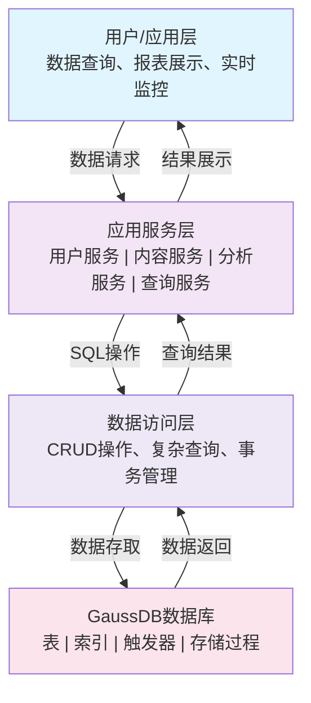

### 2.2 核心功能流程

#### 流程1：发布帖子

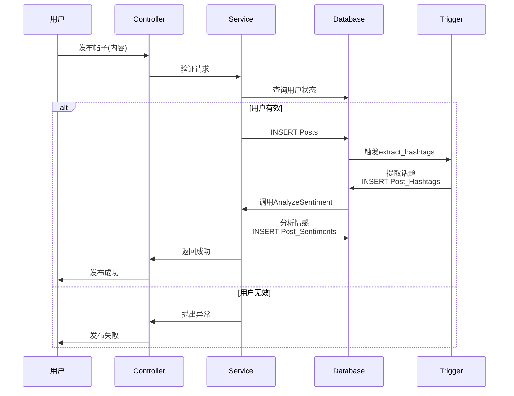

#### 流程2：热点话题查询

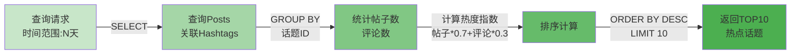

#### 流程3：舆情趋势分析

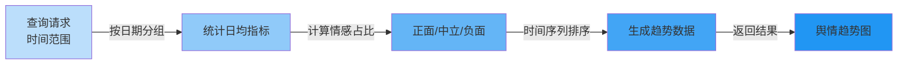

### 2.3 数据流总览

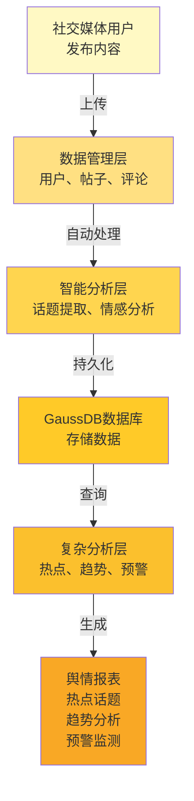

---

## 三、数据库概念模式设计

### 3.1 实体识别

系统包含**8个核心实体**：

| 实体                | 说明               | 关键属性                           |
| ------------------- | ------------------ | ---------------------------------- |
| **Users**           | 系统用户           | UserID, Username, Email, Status    |
| **Posts**           | 用户发布的帖子     | PostID, UserID, Content            |
| **Comments**        | 帖子下的评论       | CommentID, PostID, UserID, Content |
| **Hashtags**        | 话题标签           | HashtagID, HashtagName             |
| **Post_Hashtags**   | 帖子-话题关联(M:N) | PostID, HashtagID                  |
| **Sentiments**      | 情感倾向类型       | SentimentID, Label                 |
| **Post_Sentiments** | 帖子-情感关联(M:N) | PostID, SentimentID, Score         |
| **Keywords**        | 舆情监测关键词     | KeywordID, Keyword, Category       |

### 3.2 实体属性

**Users实体：** UserID(PK), Username(UK), Email(UK), PasswordHash, Status, CreatedAt, UpdatedAt

**Posts实体：** PostID(PK), UserID(FK), Content, CreatedAt, UpdatedAt

**Comments实体：** CommentID(PK), PostID(FK), UserID(FK), Content, CreatedAt, UpdatedAt

**Hashtags实体：** HashtagID(PK), HashtagName(UK), CreatedAt

**Post_Hashtags关联表：** PostHashtagID(PK), PostID(FK), HashtagID(FK), CreatedAt

**Sentiments实体：** SentimentID(PK), Label(UK), Description

**Post_Sentiments关联表：** PostSentimentID(PK), PostID(FK), SentimentID(FK), Score, CreatedAt

**Keywords实体：** KeywordID(PK), Keyword(UK), Category, CreatedAt

### 3.3 E-R图

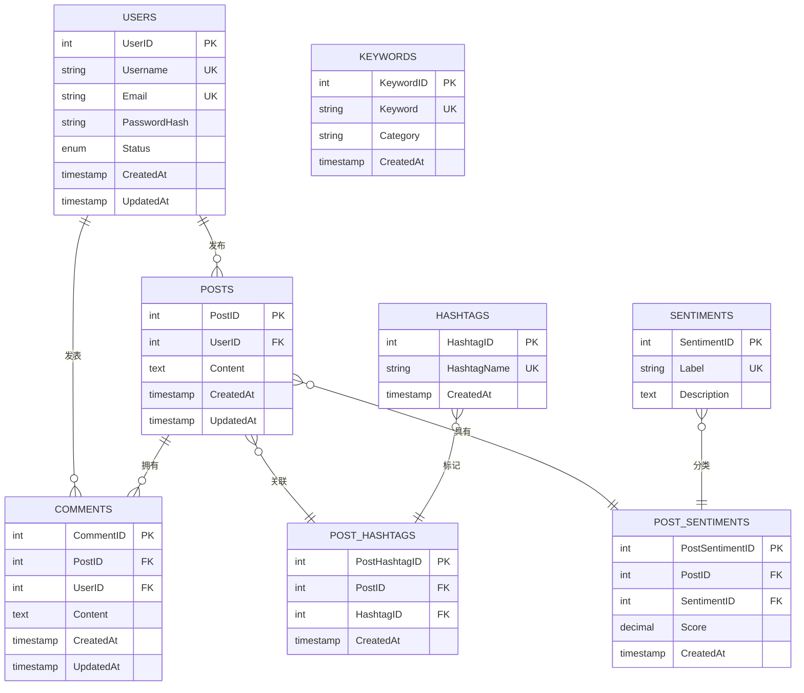

### 3.4 关系分析

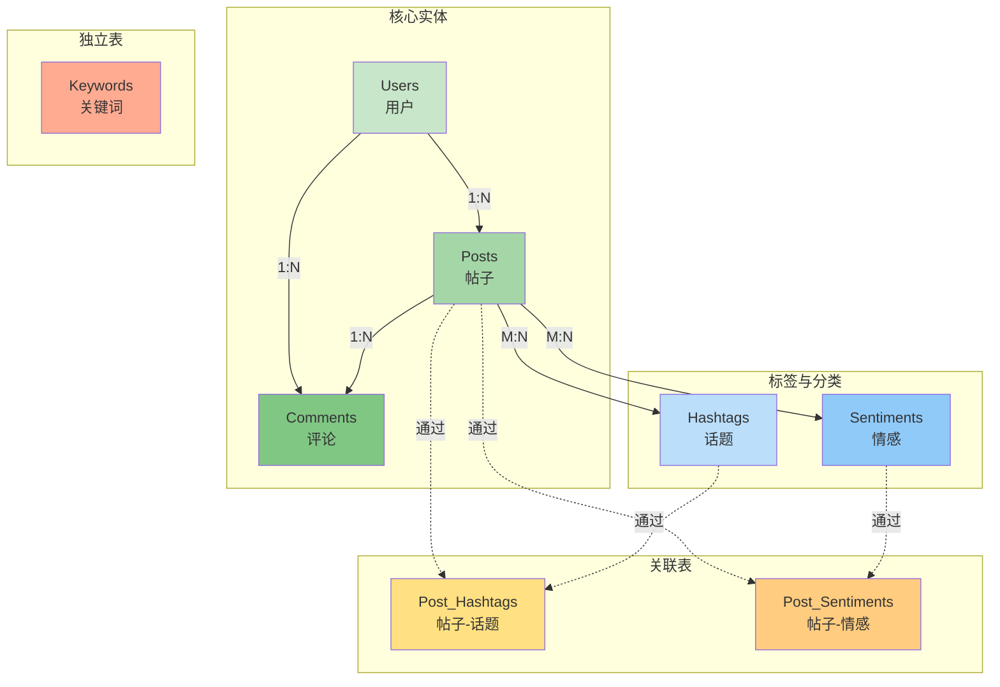

---

## 四、数据库逻辑模式设计

### 4.1 关系模式定义

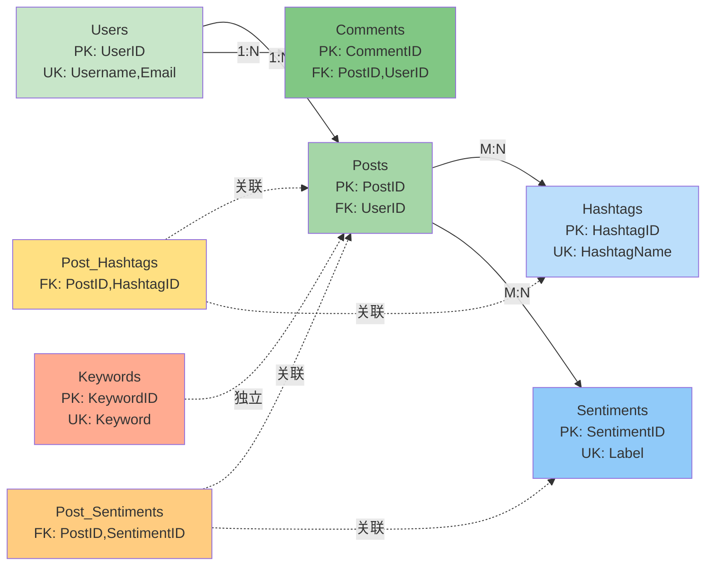

### 4.2 范式验证

#### 第一范式(1NF)

✓ **所有关系均满足1NF** - 所有属性值均为原子值，不存在重复组

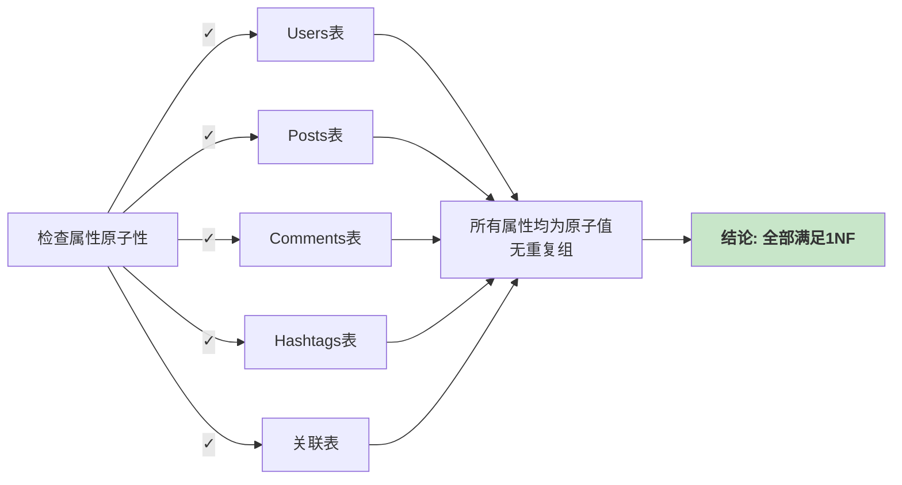

#### 第二范式(2NF)

✓ **所有关系均满足2NF** - 非主键属性完全依赖于主键

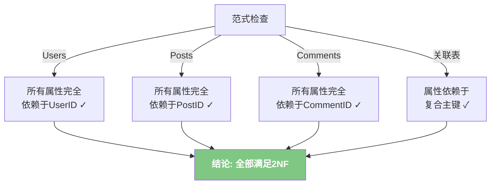

#### 第三范式(3NF)

✓ **所有关系均满足3NF** - 不存在非主键属性间的传递依赖

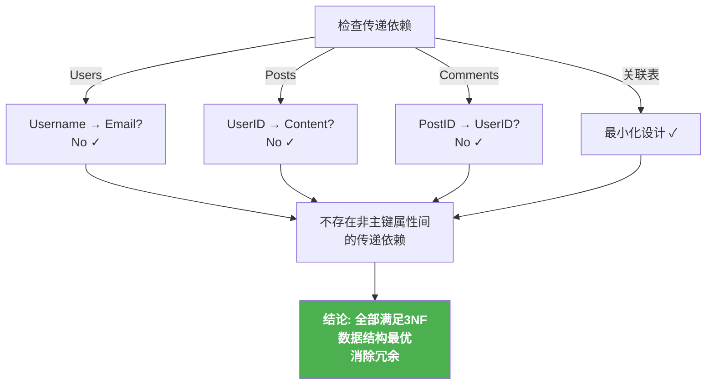

**3NF验证总结：**

| 表              | 传递依赖分析              | 结论  |
| --------------- | ------------------------- | ----- |
| Users           | 各属性独立，无依赖链      | ✓ 3NF |
| Posts           | UserID和Content无依赖关系 | ✓ 3NF |
| Comments        | 外键和属性独立            | ✓ 3NF |
| Hashtags        | 单一属性，无传递          | ✓ 3NF |
| Post_Hashtags   | 最小化，仅主键和时间戳    | ✓ 3NF |
| Post_Sentiments | Score与主键直接相关       | ✓ 3NF |
| Keywords        | 独立设计，无传递依赖      | ✓ 3NF |

### 4.3 约束完整性

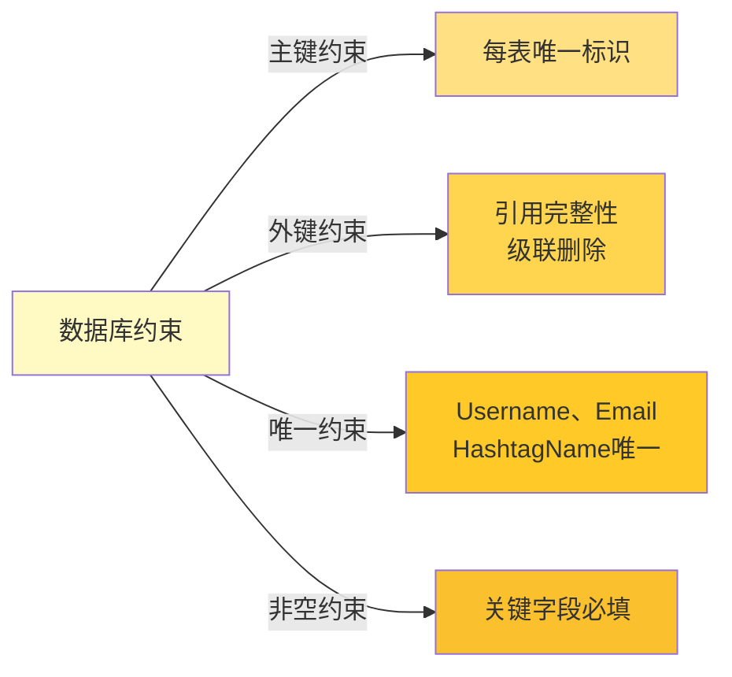

### 4.4 复杂查询设计

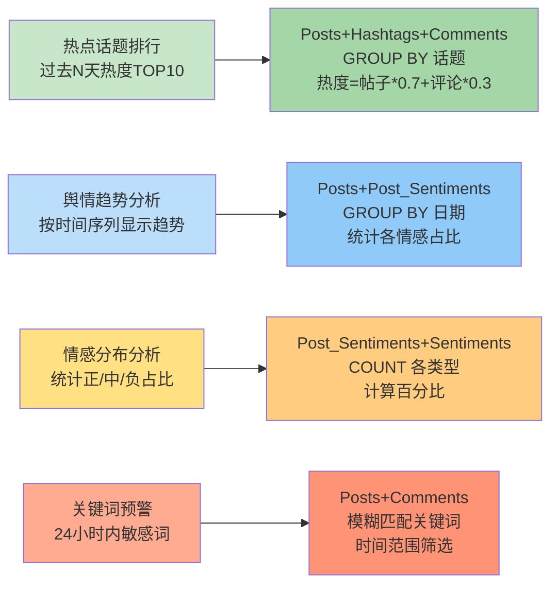

## 五、后续规划

### 5.1 核心待办事项

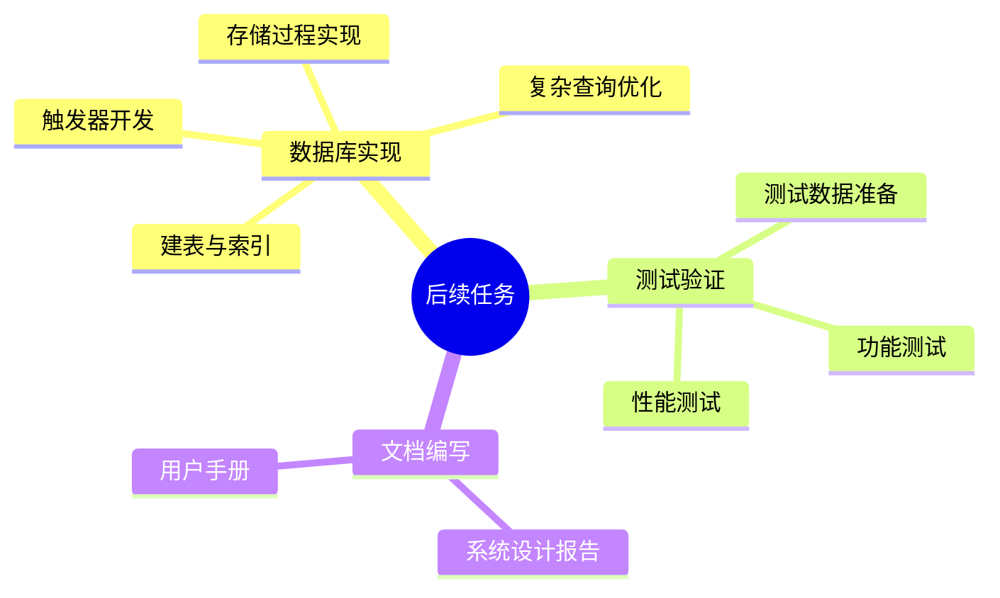

### 5.2 具体任务清单

#### **数据库实现**
- [ ] 在GaussDB中创建8个核心表
- [ ] 建立主键、外键和唯一约束
- [ ] 创建必要的索引
- [ ] 实现话题提取触发器
- [ ] 实现情感分析存储过程
- [ ] 优化4个复杂查询性能

#### **测试验证**
- [ ] 准备完整的测试数据集
- [ ] 验证所有CRUD操作
- [ ] 测试触发器功能
- [ ] 验证存储过程逻辑
- [ ] 执行复杂查询性能测试

#### **文档编写**
- [ ] 完善系统设计报告
- [ ] 编写用户操作手册
- [ ] 整理SQL脚本文档
- [ ] 准备演示材料

---
